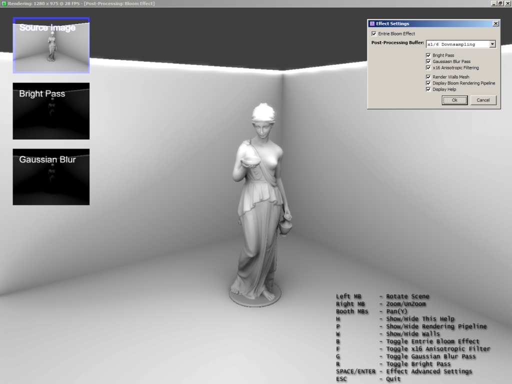

## Post\-Processing With Pixel Shaders \(Bloom\)

### Description

Usage of render targets and pixel shaders to create a post-processing bloom effect. See !readMe.txt inside archive for more info.
 
### More Info
 

             |
---                |---
**Submitted On**   |2007-07-18 07:20:18
**By**             |[\[seal\] Fg](https://github.com/Planet-Source-Code/PSCIndex/blob/master/ByAuthor/seal-fg.md)
**Level**          |Advanced
**User Rating**    |5.0 (25 globes from 5 users)
**Compatibility**  |VB 6\.0
**Category**       |[DirectX](https://github.com/Planet-Source-Code/PSCIndex/blob/master/ByCategory/directx__1-44.md)
**World**          |[Visual Basic](https://github.com/Planet-Source-Code/PSCIndex/blob/master/ByWorld/visual-basic.md)
**Archive File**   |[Post\-Proce2076087182007\.zip](https://github.com/Planet-Source-Code/seal-fg-post-processing-with-pixel-shaders-bloom__1-69014/archive/master.zip)

